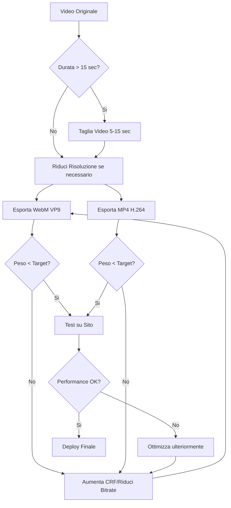

# Best Practice per Video nel Sito Web

## Indice
1. [Principi Generali](#principi-generali)
2. [Formati Video](#formati-video)
3. [Dimensioni e Risoluzioni](#dimensioni-e-risoluzioni)
4. [Peso Massimo dei File](#peso-massimo-dei-file)
5. [Video di Background](#video-di-background)
6. [Video Header di Apertura](#video-header-di-apertura)
7. [Ottimizzazione e Compressione](#ottimizzazione-e-compressione)
8. [Implementazione Tecnica](#implementazione-tecnica)

---

## Principi Generali

> [!IMPORTANT]
> **NON USARE VIDEO EMBEDDED DA YOUTUBE O ALTRE PIATTAFORME**
> 
> Per mantenere il pieno controllo sul sito e garantire le migliori performance:
> - ❌ **Evitare** YouTube, Vimeo o altre piattaforme embedded
> - ✅ **Utilizzare** video locali self-hosted
> - ✅ **Tagliare** porzioni brevi di video originali (3-15 secondi max)
> - ✅ **Ottimizzare** i file per il web prima dell'upload

### Vantaggi dei Video Locali
- Nessuna pubblicità indesiderata
- Controllo completo sul playback
- Nessuna dipendenza da servizi esterni
- Migliori performance (soprattutto con CDN)
- Privacy degli utenti garantita

---

## Formati Video

### Formati Consigliati

Utilizzare **sempre** entrambi i formati per garantire compatibilità cross-browser:

1. **WebM** (formato primario)
   - Codec: VP9 o VP8
   - Migliore compressione
   - Supportato da Chrome, Firefox, Opera, Edge
   - File più leggeri a parità di qualità

2. **MP4** (fallback)
   - Codec: H.264 (AVC)
   - Universalmente supportato
   - Compatibile con Safari e vecchi browser
   - Garantisce massima compatibilità

### Ordine di Priorità nel Codice

```html
<video autoplay muted loop playsinline>
  <source src="video.webm" type="video/webm">
  <source src="video.mp4" type="video/mp4">
</video>
```

Il browser utilizzerà il primo formato supportato.

---

## Dimensioni e Risoluzioni

### Per Video di Background

| Viewport Target | Risoluzione Consigliata | Aspect Ratio |
|----------------|------------------------|--------------|
| Desktop (Full HD) | 1920x1080px | 16:9 |
| Desktop (2K) | 2560x1440px | 16:9 |
| Mobile | 1280x720px | 16:9 |
| Tablet | 1920x1080px | 16:9 |

> [!TIP]
> **Risoluzione Raccomandata Standard: 1920x1080px (Full HD)**
> 
> Questo garantisce ottimo bilanciamento tra qualità visiva e peso del file.

### Per Video Header/Hero

| Tipo | Risoluzione | Note |
|------|------------|------|
| Standard | 1920x1080px | Ideale per la maggior parte dei casi |
| Premium | 2560x1440px | Solo se necessario per branding di alta qualità |
| Mobile-first | 1280x720px | Se il traffico è principalmente mobile |

### Aspect Ratio

- **16:9** - Standard per video orizzontali (desktop, tablet, hero sections)
- **9:16** - Verticale per mobile (se necessario)
- **1:1** - Quadrato (raramente usato per background)

---

## Peso Massimo dei File

### Limiti Consigliati

> [!WARNING]
> **Limiti di Peso Critici per Performance**

| Tipo Video | Durata | Peso Max WebM | Peso Max MP4 | Priorità |
|-----------|--------|---------------|--------------|----------|
| Background Loop | 5-10 sec | **500 KB - 1 MB** | **800 KB - 1.5 MB** | CRITICO |
| Header/Hero | 10-15 sec | **1 MB - 2 MB** | **1.5 MB - 3 MB** | ALTA |
| Intro/Splash | 5-8 sec | **800 KB - 1.5 MB** | **1.2 MB - 2 MB** | ALTA |

### Regole Generali

1. **Video di Background**: 
   - Target ideale: **500-800 KB** (WebM)
   - Massimo accettabile: **1.5 MB** (WebM)
   - Durata: 5-10 secondi in loop

2. **Video Header di Apertura**:
   - Target ideale: **1-1.5 MB** (WebM)
   - Massimo accettabile: **2-2.5 MB** (WebM)
   - Durata: 8-12 secondi (play once, no loop)

3. **Video Promozionali/Contenuti**:
   - Possono essere più pesanti (5-10 MB)
   - Caricamento lazy/on-demand
   - Non in autoplay

> [!CAUTION]
> **Performance Impact**
> 
> Video oltre i 2 MB possono causare:
> - Rallentamento del caricamento pagina
> - Consumo eccessivo di banda (soprattutto su mobile)
> - Penalizzazione nei Core Web Vitals (LCP)
> - Esperienza utente degradata su connessioni lente

---

## Video di Background

### Caratteristiche Ideali

```markdown
✅ Durata: 5-10 secondi max
✅ Loop perfetto (seamless)
✅ Motion leggero e fluido
✅ Colori tenui/non troppo contrastati
✅ No audio (sempre muted)
✅ Compressione aggressiva (qualità OK se in background)
```

### Esempio di Implementazione

```html
<div class="video-background">
  <video autoplay muted loop playsinline preload="auto">
    <source src="/assets/videos/bg-loop.webm" type="video/webm">
    <source src="/assets/videos/bg-loop.mp4" type="video/mp4">
  </video>
  <div class="overlay"></div>
  <div class="content">
    <!-- Il tuo contenuto qui -->
  </div>
</div>
```

```css
.video-background {
  position: relative;
  width: 100%;
  height: 100vh;
  overflow: hidden;
}

.video-background video {
  position: absolute;
  top: 50%;
  left: 50%;
  min-width: 100%;
  min-height: 100%;
  width: auto;
  height: auto;
  transform: translate(-50%, -50%);
  object-fit: cover;
  z-index: -1;
}

.video-background .overlay {
  position: absolute;
  top: 0;
  left: 0;
  width: 100%;
  height: 100%;
  background: rgba(0, 0, 0, 0.3); /* Overlay scuro per leggibilità */
  z-index: 0;
}

.video-background .content {
  position: relative;
  z-index: 1;
}
```

### Best Practice Specifiche

1. **Loop Seamless**: assicurarsi che primo e ultimo frame siano identici
2. **Motion Blur**: ridurre i movimenti rapidi per compressione migliore
3. **Mobile**: considerare l'utilizzo di immagini statiche su mobile (per risparmiare banda)
4. **Preload**: usare `preload="auto"` per background critici
5. **Overlay**: aggiungere sempre un overlay semitrasparente per leggibilità del testo

---

## Video Header di Apertura

### Caratteristiche Ideali

```markdown
✅ Durata: 8-15 secondi max
✅ NO loop (play once)
✅ Alta qualità visiva (è il primo impatto)
✅ Transizione smooth a contenuto statico
✅ Possibile audio (opzionale, muted di default)
```

### Esempio di Implementazione

```html
<div class="hero-video">
  <video 
    id="heroVideo"
    autoplay 
    muted 
    playsinline 
    preload="auto"
    onended="onHeroVideoEnd()"
  >
    <source src="/assets/videos/hero-intro.webm" type="video/webm">
    <source src="/assets/videos/hero-intro.mp4" type="video/mp4">
  </video>
  <div class="hero-content fade-in-delayed">
    <h1>Benvenuto</h1>
    <p>Il tuo messaggio</p>
  </div>
</div>
```

```javascript
function onHeroVideoEnd() {
  const video = document.getElementById('heroVideo');
  video.style.opacity = '0';
  
  // Mostra contenuto statico
  setTimeout(() => {
    video.style.display = 'none';
    document.querySelector('.hero-content').classList.add('visible');
  }, 500);
}
```

```css
.hero-video video {
  width: 100%;
  height: 100vh;
  object-fit: cover;
  transition: opacity 0.5s ease-out;
}

.hero-content {
  position: absolute;
  top: 50%;
  left: 50%;
  transform: translate(-50%, -50%);
  opacity: 0;
  transition: opacity 1s ease-in;
}

.hero-content.visible {
  opacity: 1;
}
```

### Best Practice Specifiche

1. **Qualità**: può essere leggermente più alta rispetto ai background loop
2. **Transizione**: prevedere sempre una transizione elegante a fine video
3. **Fallback**: immagine poster di alta qualità come fallback
4. **Mobile**: considerare video più brevi (5-8 sec) o immagine statica
5. **UX**: permettere skip del video (opzionale)

---

## Ottimizzazione e Compressione

### Strumenti Consigliati

#### 1. **FFmpeg** (Command Line - Massimo Controllo)

**Compressione WebM (VP9):**
```bash
ffmpeg -i input.mp4 -c:v libvpx-vp9 -b:v 500k -crf 33 -an -vf scale=1920:1080 output.webm
```

**Compressione MP4 (H.264):**
```bash
ffmpeg -i input.mp4 -c:v libx264 -b:v 800k -crf 28 -preset slow -an -vf scale=1920:1080 output.mp4
```

**Parametri Chiave:**
- `-b:v`: Bitrate video (più basso = file più piccolo)
- `-crf`: Constant Rate Factor (18-28 per MP4, 30-40 per WebM)
- `-preset`: slow/medium/fast (slow = migliore compressione)
- `-an`: Rimuove audio (non necessario per background)
- `-vf scale`: Imposta risoluzione

#### 2. **HandBrake** (GUI - User Friendly)

Impostazioni consigliate:
- Preset: "Web" o "General > Fast 1080p30"
- Video Codec: H.264 (x264) per MP4
- Quality: RF 26-30
- Framerate: 24-30 fps (costante)
- Resolution: 1920x1080

#### 3. **Adobe Media Encoder** / **DaVinci Resolve** (Professionale)

Per chi ha accesso a software professionale:
- Esportare in H.264 con bitrate variabile (VBR)
- Target bitrate: 2-4 Mbps per 1080p
- Audio: nessuno o AAC a 128 kbps

### Parametri di Compressione Dettagliati

| Parametro | Background Loop | Header Video | Note |
|-----------|----------------|--------------|------|
| **Bitrate Video** | 400-600 kbps | 800-1200 kbps | Più basso = file più piccolo |
| **CRF (Quality)** | 32-36 | 26-30 | Più alto = più compressione |
| **Frame Rate** | 24 fps | 30 fps | 24 fps è sufficiente per background |
| **Keyframe Interval** | 240 | 120 | Per loop perfetti |
| **Audio** | Nessuno | Nessuno/128 kbps | Rimuovere se non necessario |

### Workflow di Ottimizzazione



---

## Implementazione Tecnica

### Checklist Pre-Deploy

```markdown
- [ ] Video tagliato a durata ottimale (5-15 sec)
- [ ] Creati entrambi i formati (WebM + MP4)
- [ ] Verificato peso file (< target definito)
- [ ] Loop testato (seamless)
- [ ] Testato su Chrome, Firefox, Safari
- [ ] Testato su mobile (iOS/Android)
- [ ] Immagine poster preparata (fallback)
- [ ] Lazy loading implementato (se non critico)
- [ ] Performance verificata (Lighthouse)
```

### Attributi HTML5 Video Essenziali

```html
<video 
  autoplay          <!-- Avvio automatico -->
  muted             <!-- Silenzioso (OBBLIGATORIO per autoplay) -->
  loop              <!-- Ripetizione continua -->
  playsinline       <!-- Play inline su iOS (non fullscreen) -->
  preload="auto"    <!-- Precarica il video -->
  poster="image.jpg" <!-- Immagine di placeholder -->
>
  <source src="video.webm" type="video/webm">
  <source src="video.mp4" type="video/mp4">
  Il tuo browser non supporta i video HTML5.
</video>
```

### Performance Optimization

#### Lazy Loading per Video Non Critici

```html
<video class="lazy-video" data-src="video.webm" poster="poster.jpg">
  <!-- Video caricato solo quando visibile -->
</video>
```

```javascript
// Intersection Observer per lazy loading
const videoObserver = new IntersectionObserver((entries) => {
  entries.forEach(entry => {
    if (entry.isIntersecting) {
      const video = entry.target;
      video.src = video.dataset.src;
      video.load();
      videoObserver.unobserve(video);
    }
  });
});

document.querySelectorAll('.lazy-video').forEach(video => {
  videoObserver.observe(video);
});
```

#### Responsive Video (Mobile vs Desktop)

```html
<video autoplay muted loop playsinline>
  <source 
    src="video-desktop.webm" 
    type="video/webm" 
    media="(min-width: 768px)"
  >
  <source 
    src="video-mobile.webm" 
    type="video/webm" 
    media="(max-width: 767px)"
  >
  <source src="video-desktop.mp4" type="video/mp4">
</video>
```

### Considerazioni Mobile

> [!WARNING]
> **Limitazioni iOS/Safari**
> 
> - Autoplay richiede SEMPRE `muted` e `playsinline`
> - iOS consuma molta batteria con video in autoplay
> - Considerare immagini statiche sotto i 768px

```javascript
// Disabilita video su mobile per risparmiare banda
if (window.innerWidth < 768) {
  document.querySelectorAll('.video-background video').forEach(video => {
    video.style.display = 'none';
    // Mostra immagine statica alternativa
  });
}
```

---

## Riepilogo Rapido

### Quick Reference

| Elemento | Formato | Dimensione | Peso Max | Durata |
|----------|---------|------------|----------|--------|
| **Background Loop** | WebM + MP4 | 1920x1080 | 500 KB - 1 MB | 5-10 sec |
| **Header Hero** | WebM + MP4 | 1920x1080 | 1-2 MB | 8-15 sec |
| **Mobile Background** | WebM + MP4 | 1280x720 | 300-500 KB | 5-8 sec |

### Comando FFmpeg Standard (Copy-Paste Ready)

**WebM Background:**
```bash
ffmpeg -i input.mp4 -c:v libvpx-vp9 -b:v 500k -crf 33 -an -vf scale=1920:1080 -r 24 output.webm
```

**MP4 Background:**
```bash
ffmpeg -i input.mp4 -c:v libx264 -b:v 800k -crf 28 -preset slow -an -vf scale=1920:1080 -r 24 output.mp4
```

### Troubleshooting Comune

| Problema | Soluzione |
|----------|-----------|
| Video non si avvia su mobile | Aggiungi `playsinline muted` |
| File troppo grande | Aumenta CRF o riduci bitrate |
| Video pixelato | Riduci CRF o aumenta bitrate |
| Loop non fluido | Verifica keyframe interval e primo/ultimo frame |
| Safari non riproduce video | Aggiungi formato MP4 come fallback |

---

## Risorse Aggiuntive

### Tools Online Utili

- **CloudConvert**: conversione video online (per piccole modifiche)
- **Clipchamp**: editor video online Microsoft
- **Canva**: per creare brevi video loop
- **Ezgif**: ottimizzazione video online

### Reference Links

- [MDN Web Video](https://developer.mozilla.org/en-US/docs/Web/HTML/Element/video)
- [WebM Project](https://www.webmproject.org/)
- [FFmpeg Documentation](https://ffmpeg.org/documentation.html)
- [Core Web Vitals](https://web.dev/vitals/)

---

*Documento creato: 2026-02-03*  
*Progetto: LABPRO_KIMI*
